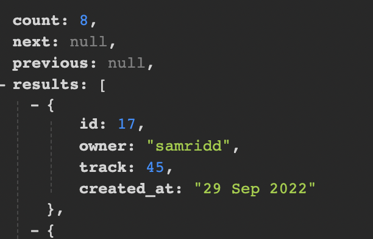
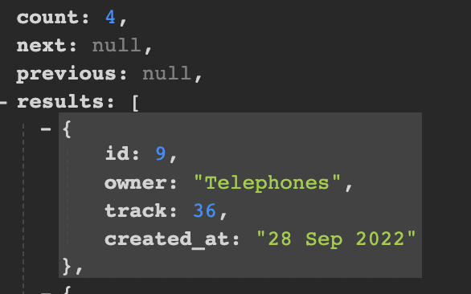

# Sound Space API

This API was built for use with the front end react application [SoundSpace](https://soundspace-fe.herokuapp.com/)

Live Link: https://soundspace-api.herokuapp.com/

The repository for the front end can be found [here](https://github.com/vfg-95/soundspace)
and the readme for the project is [here](https://github.com/vfg-95/soundspace/blob/main/README.md)

## Database

The database for the project was built with [Django-REST-Framework](https://www.django-rest-framework.org/)

### Schema

Below is the database schema for the API, displaying the models and their relationships:

SQLite was used for the database during development, and and PostgreSQL was used for produciton.

## Testing

The following functionality was tested on the database:

The following screenshots show corresponding data from the front end stored in the deployed API:

- Profile:

- Track:

- Like:

- Repost:

- Follow:

- Comment:

### pep8

I validated the code using pycodestyle to test that it met pep8 standards/requirements. These were met, the only file with errors being the settings.py file for having lines too long - I did not change these so as to keep the settings in order.

## Deployment

1.  Clone [this repository](https://github.com/vfg-95/ss_api).
2.  In your IDE, connect to your repo, then enter this command in the terminal:
        
        pip install -r requirements.txt

- Ensure INSTALLED_APPS in settings.py matches the repository

3. In you terminal, enter these commands in the terminal:

        python manage.py makemigrations
        python manage.py migrate

4.  Git add, commit and push all changes to your repo.
5.  Create or log in to an account on Heroku.
6.  Create a new app on Heroku.
7.  Open your app on Heroku, go to Resources, Add-ons and search for PostgreSQL, then add it.
8.  In the Deploy tab on Heroku, go to Deployment method and add your GitHub repository.
9.  In the Deploy tab on Heroku, go to Manual deploy and select deploy branch for early deployment.
10. Create or log in to an account on Cloudinary.
11. Copy your API Environment Variable.
12. Go back to Heroku, Settings and click on Reveal Config Vars.
13. Add these variables to your config vars. PostgreSQL DATABASE_URL should already be there.
    - ALLOWED_HOST | your_deployed_api_url
    - CLIENT_ORIGIN | your_deployed_frontend_url
    - CLIENT_ORIGIN_DEV | your_local_server_url
    - CLOUDINARY_URL | your_api_variable
    - SECRET_KEY | your_choice ([Secret Key Generator](https://miniwebtool.com/django-secret-key-generator/))
    - DISABLE_COLLECTSTATIC | 1
14. Create an env.py in the root directory, add it to .gitignore and add these lines at the top

        import os

        os.environ["SECRET_KEY"] = "your secret_key here"
        os.environ["CLOUDINARY_URL"] = "cloudinary url here"
        os.environ['DEV'] = '1'

15. In settings.py, update the CORS_ALLOWED_ORIGIN_REGEXES variable to match your local server url.

        if 'CLIENT_ORIGIN_DEV' in os.environ:
            extracted_url = re.match(r'^.+-', os.environ.get('CLIENT_ORIGIN_DEV', ''), re.IGNORECASE).group(0)
            CORS_ALLOWED_ORIGIN_REGEXES = [
                rf"{extracted_url}(eu|us)\d+\w\.gitpod\.io$",
            ]

16. Create a superuser for your site:

        python manage.py createsuperuser

17. To run your app locally, enter this command in your terminal:
        python manage.py runserver
    
The project is now set up to automatically switch between DEBUG: True and False for development server and deployed site.

### Production Deployment

1.  If changes has been made, make sure to run migrations:

        python manage.py makemigrations
        python manage.py migrate

2.  Git add, commit and push all changes to your repo.
3.  On Heroku, go to Deploy and and choose manual deploy.

## Credits

The database was based upon the Code Institute [DRF-API](https://github.com/Code-Institute-Solutions/drf-api) which provided me with a lot of the functionality required from my API.

